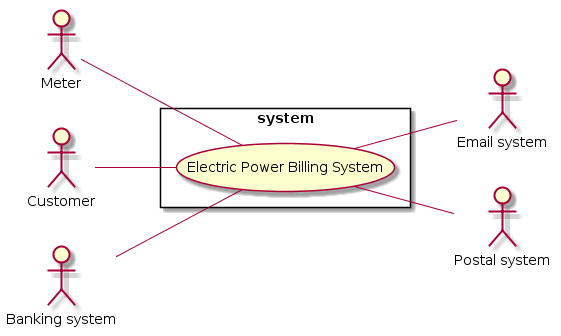

## Informal requirements

Each house connected to the electric network has a meter. The meter computes and stores how much electrical energy (kW hour) is used by the house. 

The meter sends regularly (say every 24 hours) the consumption over the electric wires (the electric wires of the power network can in fact be used as data transmission lines). 

A remote central server receives the data, stores it and computes a bill (say every two months), sends the bill to the customer. 

The bill can be sent in two different ways:
 
* electronically (email or web site accessible to the customer via username and password),
* on paper.

In the following analyze and model the application that collects power usage from each meter, computes the bill and sends it to the customer. 

1. Define the context diagram (including relevant interfaces)
2. List the requirements in tabular form
3. Write a glossary by defining the key concepts and entities and their relationships, with UML class diagram, for the application 
4. Define the system design diagram


## Context diagram and interfaces

### Context diagram

```plantuml
left to right direction
skinparam packageStyle rectangle

:Meter: as m
:Customer: as c
:Email system: as es
:Postal system: as ps
:Banking system: as bs

rectangle system {
  (Electric Power Billing System) as epbs
}

m -- epbs
c -- epbs
bs -- epbs
epbs -- es
epbs -- ps
```


### Interfaces

| Actor          | Physical            | Logical                      |
| -------------- | ------------------- | ---------------------------- |
| Meter          | electric wires      |                              |
| Customer       | internet connection | Web-page (GUI)               |
| Email system   | internet connection | Web service, POP, IMAP, SMTP |
| Postal system  | internet connection | Web service (APIs)           |
| Banking system | internet connection | Web service (APIs)           |


## Requirements

### Functional
| ID | Description                                        |
|:--:| -------------------------------------------------- |
| F1 | Read consumption from meter                        |
| F2 | Store consumption read with contextual information |
| F3 | Compute bill                						  |
| F4 | Send bill to customer via email 				      |
| F5 | Send bill to customer via postal system            |

### Non functional
| ID  | Type    | Description 										 |
|:---:|:-------:| -------------------------------------------------- |
| NF1 | Privacy | Data of customers have to be not visible to others | 
| NF2 | Domain  | Currency is euro 									 |
| NF2 | Domain  | Electric consumption is in KWh 					 |


## Glossary

```plantuml
class Customer
class Meter
class Contract
class Bill
class MeterReading

Customer : ID
Customer : name
Customer : surname
Customer : address
Meter : ID
Bill : ID
Bill : date
Bill : consumption
Bill : amount
Bill : period
MeterReading : date
MeterReading : consumption

Customer "1" -- "*" Contract : signs to <
Contract "1" -- "1" Meter : assigns
Contract "1" -- "1..*" MeterReading : lists
Contract "1" -- "*" Bill : generates

Note top of Contract : It is necessary because one customer may have more houses,\nit is not possible to associate a meter to a customer
```


