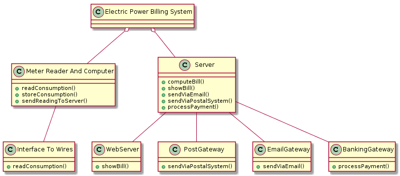

## Informal description


## Context diagram and interfaces

### Context diagram

```plantuml
left to right direction
skinparam packageStyle rectangle

:Meter: as m
:Customer: as c
:Email system: as es
:Postal system: as ps
:Banking system: as bs

rectangle system {
  (Electric Power Billing System) as epbs
}

m -- epbs
c -- epbs
bs -- epbs
epbs -- es
epbs -- ps
```


### Interfaces

| Actor          | Physical            | Logical                      |
| -------------- | ------------------- | ---------------------------- |
| Meter          | electric wires      |                              |
| Customer       | internet connection | Web-page (GUI)               |
| Email system   | internet connection | Web service, POP, IMAP, SMTP |
| Postal system  | internet connection | Web service (APIs)           |
| Banking system | internet connection | Web service (APIs)           |


## Requirements

### Functional
| ID | Description                                        |
|:--:| -------------------------------------------------- |
| F1 | Read consumption from meter                        |
| F2 | Store consumption read with contextual information |
| F3 | Compute bill                						  |
| F4 | Send bill to customer via email 				      |
| F5 | Send bill to customer via postal system            |

### Non functional
| ID  | Type    | Description 										 |
|:---:|:-------:| -------------------------------------------------- |
| NF1 | Privacy | Data of customers have to be not visible to others | 
| NF2 | Domain  | Currency is euro 									 |
| NF2 | Domain  | Electric consumption is in KWh 					 |


## Glossary

```plantuml
class Customer
class Meter
class Contract
class Bill
class MeterReading

Customer : ID
Customer : name
Customer : surname
Customer : address
Meter : ID
Bill : ID
Bill : date
Bill : consumption
Bill : amount
Bill : period
MeterReading : date
MeterReading : consumption

Customer "1" -- "*" Contract : signs to <
Contract "1" -- "1" Meter : assigns
Contract "1" -- "1..*" MeterReading : lists
Contract "1" -- "*" Bill : generates

Note top of Contract : It is necessary because one customer may have more houses,\nit is not possible to associate a meter to a customer
```


## System design
```plantuml
class "Electric Power Billing System"
class "Meter Reader And Computer"
class "Interface To Wires"
class Server
class WebServer
class PostGateway
class EmailGateway
class BankingGateway

"Meter Reader And Computer" : +readConsumption()
"Meter Reader And Computer" : +storeConsumption()
"Meter Reader And Computer" : +sendReadingToServer()
"Interface To Wires" : +readConsumption()
Server : +computeBill()
Server : +showBill()
Server : +sendViaEmail()
Server : +sendViaPostalSystem()
Server : +processPayment()
WebServer : +showBill()
PostGateway : +sendViaPostalSystem()
EmailGateway : +sendViaEmail()
BankingGateway : +processPayment()

"Electric Power Billing System" o-- "Meter Reader And Computer"
"Electric Power Billing System" o-- Server
"Meter Reader And Computer" -- "Interface To Wires"
Server -- PostGateway
Server -- EmailGateway
Server -- WebServer
Server -- BankingGateway
```

