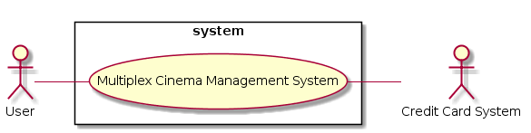
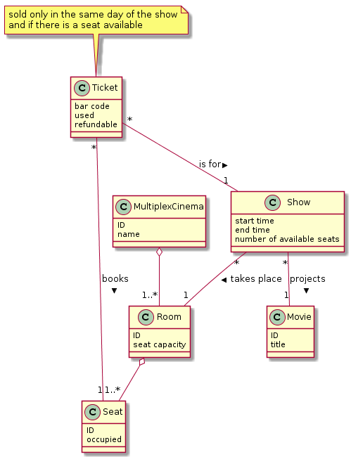
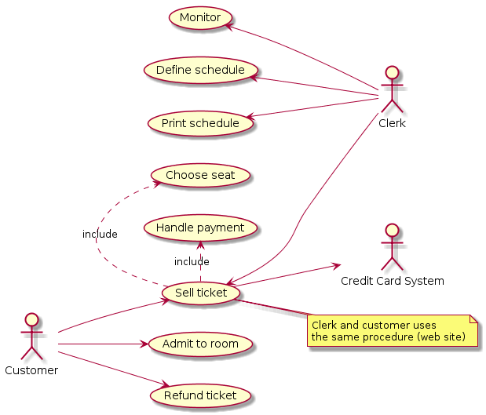
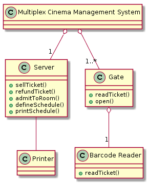

# Multiplex cinema management.

A multiplex cinema is composed of several rooms, each room may show a different movie, with a different schedule. Each room has a specific seat capacity, to be strictly enforced for safety regulations.

Each seat in a room has an id. A management system for a multiplex cinema has to be built because there are several multiplex cinemas across Italy.

The management system will be used by clerks to sell tickets at a counter in the cinema. The sale of a ticket can also be done via Internet, the customers buy it connecting to a web site. A ticket is valid for a specific seat, in a specific room, for a specific show (movie and start time).

A ticket is unique and has a bar code. The ticket must be printed to guarantee admission. A ticket is sold only in the same day of the show, and only if there is a seat available. The user can choose the seat. A ticket is refundable, if not used.

Another function of the system is admitting (or rejecting) people to the rooms. Admission is regulated by a gate, which opens after showing a valid ticket to a bar code reader. There is a first row of gates controlling access to all rooms, then a gate controlling access to each room.

Other functions supported by the system are refund of a ticket various monitor functions for the clerks (how many persons are in a room, how many seats available for a room/movie session, average occupation of a room per day/ per session); definition of the schedule for the day (what movie for what room at what time); printout of the schedule of the day.

- Define the context diagram (including relevant interfaces)
- Define the class diagram
- Define the use case diagram
- Define one scenario describing a successful sale for a ticket for a movie.
- Define one scenario describing a successful admission to a room.
- Define the system design diagram


## Context diagram and Interfaces

### Context diagram
```plantuml
left to right direction
skinparam packageStyle rectangle

:User: as u
:Credit Card System: as ccs

rectangle system {
	(Multiplex Cinema Management System) as mcms
}

u -- mcms
mcms -- ccs
```


### Interfaces
| Actor              | Physical            | Logical 									|
|:------------------:|:-------------------:|:------------------------------------------:|
| User               | Screen and keyboard | GUI (web page accessible through Internet) |
| Credit Card System | Internet connection | Web service (APIs) 						|


## Glossary
```plantuml
class MultiplexCinema
class Room
class Movie
class Seat
class Ticket
class Show

MultiplexCinema : ID
MultiplexCinema : name
Room : ID
Room : seat capacity
Movie : ID
Movie : title
Seat : ID
Seat : occupied
Ticket : bar code
Ticket : used
Ticket : refundable
Show : start time
Show : end time
Show : number of available seats

MultiplexCinema o-- "1..*" Room
Room o-- "1..*" Seat
Ticket "*" -- "1" Seat : books >
Ticket "*" -- "1" Show : is for >
Show "*" -- "1" Movie : projects >
Show "*" -- "1" Room : takes place >

Note top of Ticket : sold only in the same day of the show\nand if there is a seat available
```



## Use case diagram
```plantuml
left to right direction

:Clerk: as cl
:Customer: as cu
:Credit Card System: as ccs

together {
	(Sell ticket) as st
	(Choose seat) as cs
	(Handle payment) as hp
}
(Admit to room) as ar
(Refund ticket) as rt
(Monitor) as m
(Define schedule) as ds
(Print schedule) as ps

st <-- cl
cu --> st
st --> ccs
cu --> ar
cu --> rt
m <-- cl
ds <-- cl
ps <-- cl

st .> cs : include
st .> hp : include

note right of st : Clerk and customer uses\nthe same procedure (web site)
```



## Scenarios
### Successful sale for a ticket for a movie

Precondition: there is at least one seat available for the show and it is the same day of the show
Post condition: the selected seat is occupied

| Scenario ID: SC1 | Corresponds to UC: Sell ticket |
|:----------------:| ------------------------------ |
| Step # | Description |
| 1 | User selects show |
| 2 | User selects seat |
| 3 | User pays |
| 4 | System sets the seat as occupied, decreases the total number of seats available |

### Successful admission to a room

Precondition: customer has a valid ticket and has already passed the first row of gates
Post condition: the ticket is used

| Scenario ID: SC2 | Corresponds to UC: Admit to room |
|:----------------:| -------------------------------- |
| Step # | Description |
| 1 | Customer shows ticket to the barcode reader |
| 2 | System checks if the ticket is valid for show |
| 3 | Room gate opens and customer enters |
| 4 | System sets the ticket as used |


## System design
```plantuml
class "Multiplex Cinema Management System"
class Server
class Printer
class Gate
class "Barcode Reader"

Server : +sellTicket()
Server : +refundTicket()
Server : +admitToRoom()
Server : +defineSchedule()
Server : +printSchedule()
Gate : +readTicket()
Gate : +open()
"Barcode Reader" : +readTicket()

"Multiplex Cinema Management System" o-- "1" Server
"Multiplex Cinema Management System" o-- "1..*" Gate
Gate o-- "1" "Barcode Reader"
Server -- Printer
```
