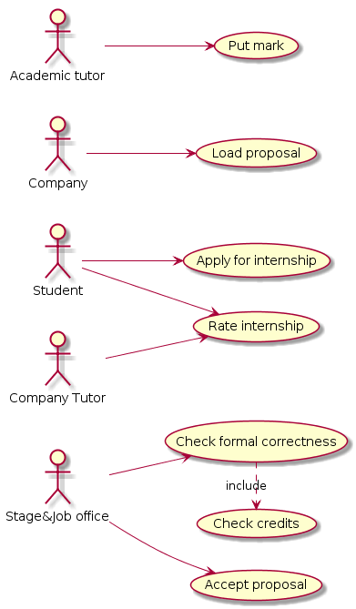

# Internship

In order to perform the internship, each student has to select a proposal from a list. Each proposal is acknowledged by a company agreement with the university.

The Stage & Job office receives the request, verifies the formal correctness (e.g. by checking if the student has enough credits for applying the internship) and then it activates the internship
At this point the student must find an academic tutor (a professor) who wants to follow the training program, and then the student enters his/her name in the request. The academic tutor must countersign the request as well as the company tutor (already defined by the company in the proposal).

Once the Stage & Job office accepts the proposal the company (in accordance with the student)
defines for the internship a start date, and an end date

The student begins the internship at the specified date.
At the end of the internship, the student must deliver to the office Stage & Job the attendance sheet In addition, both the company tutor and the student must complete a specific evaluation questionnaire.

The professor must then assign a mark for the internship.

At this point the internship is recorded in the student's academic career.

- Provide the UML Use Case Diagram for the case study described above
- Identify the three main use cases, and for each use case describe the related scenarios


## Use Case Diagram
```plantuml
left to right direction

:Student: as s
:Stage&Job office: as sjo
:Company: as c
:Company Tutor: as ct
:Academic tutor: as at

(Load proposal) as lp
(Apply for internship) as ai
(Check formal correctness) as cfc
(Check credits) as cc
(Accept proposal) as ap
(Rate internship) as ri
(Put mark) as pm

c --> lp
s --> ai
sjo --> cfc
sjo --> ap
s --> ri
ct --> ri
at --> pm

cfc .> cc : include
```


## Scenarios
### Internship proposal
Precondition: the company is registered in the university information system
Post condition: the proposal is in the list

| Scenario ID: SC1 | Corresponds to UC: Load proposal |
|:----------------:| -------------------------------- |
| Step #           | Description  					  |
| 1                | Company selects 'add new proposal' |
| 2                | System shows forms for describing proposal |
| 3                | Company adds proposal details in the form and confirms |
| 4                | System adds the proposal to the list |

### Internship selection
Precondition: the student is enrolled in the university and he is logged in
Post condition: the request is sent to the stage&job office

| Scenario ID: SC2 | Corresponds to UC: apply for internship |
|:----------------:| -------------------------------- |
| Step #           | Description  					  |
| 1                | Student selects 'show proposals' |
| 2                | System shows the list of proposals |
| 3                | Student selects the proposal |
| 4                | System shows details of the proposal |
| 5                | Student inserts the professor's name and clicks 'apply' |
| 6                | System stores the request and sends it to the Stage&Job office |

### Evaluation and mark
Precondition: the professor is the tutor of the internship
Post condition: the grade is registered in the student's career

| Scenario ID: SC3 | Corresponds to UC: Put mark |
|:----------------:| -------------------------------- |
| Step #           | Description  					  |
| 1                | Academic tutor selects the internship |
| 2                | System shows the form for evaluating |
| 3                | Academic tutor compiles the form (mark, etc.) and clicks 'confirm' |
| 4                | System stores the grade in the student's career |