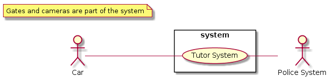
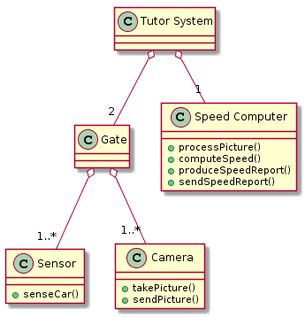

# Speed Monitoring System on Highways

Traditional speed monitoring systems measure the instantaneous speed of a car on a street,
following the car for few meters with radar based appliances.

The idea of the Tutor system instead is to measure the average speed of a car on a long distance (in
the order of 1-10 kilometers).

This is made by measuring the time when a car passes at point A, the time when the same car passes at point B, and doing simple math to compute the average speed. In point A and B on the highway a gate is built with one or more cameras that take pictures of cars passing, triggered by a motion sensor.

The pictures along with the time when they were shot, are sent to a computer based system
for processing.

The output is the average speed of each car passed through the gates.

In the following you should model this system, including hardware (cameras, computers) and
software (notably functions provided).

+ Define the stakeholders analysis
+ Define the context diagram (including relevant interfaces)
+ Define the glossary with a class diagram.
+ Define the functional requirements
+ Define the non functional requirements
+ Define the use case diagram
+ Define one scenario describing a successful measurement of the speed of a vehicle.
+ Define one scenario describing an unsuccessful measurement.
+ Define the system design

We are assuming that the speed report is sent to the police.


## Stakeholders

| Stakeholder name | Description |
|:----------------:| ----------- |
| Driver | Passes through measured paths |
| Police | Receives speed reports of drivers |
| Owner | Buys hardware and software, provides speed reports |
| System administrator | Manages the system |
| DBMS administrator | Manages the DBMS which system is based on |


## Context diagram and interfaces

### Context diagram
```plantuml
left to right direction
skinparam packageStyle rectangle

:Car: as c
:Police System: as ps

rectangle system {
	(Tutor System) as ts
}

c -- ts
ts -- ps

note "Gates, sensors and cameras are part of the system" as n
```


### Interfaces
| Actor | Physical | Logical |
|:-----:| -------- | ------- |
| Car | Sensor and Camera | |
| Police System | Internet connection | APIs |

Speed reports should be defined (XML, JSON, etc.) and should include number plate of the car, timestamp, speed, link to the picture.


## Glossary
```plantuml
class Gate
class Picture
class "Speed Computer"
class "Speed Report"

Gate : ID
Gate : point
Picture : ID
Picture : filename
"Speed Computer" : distance A to B
"Speed Report" : number of plate
"Speed Report" : speed average
"Speed Report" : time A
"Speed Report" : time B
"Speed Report" : link picture A
"Speed Report" : link picture B

Gate "1" -- "*" Picture : produces >
"Speed Computer" "1" -- "*" Picture : receives >
"Speed Computer" "1" -- "*" "Speed Report" : produces >

note right of Gate : It contains cameras and sensors\nPoint is A or B
```


## Requirements
### Functional requirements
| ID | Description |
|:--:| ----------- |
| F1 | Compute speed |
| F1.1 | Sense car |
| F1.2 | Take picture |
| F1.3 | Process pictures (recognize number of plate) |
| F2 | Produce speed report |
| F3 | Send speed report |

### Non functional requirements
| ID | Type | Description | Refers to |
|:--:|:----:| ----------- |:---------:|
| NF1 | Domain | Speed is in km/h | F1 |
| NF2 | Reliability | Unsuccessful measurements shall be less than 5% of the total | F1 |
| NF3 | Reliability | System downtime shall be less than 30 minutes per week | F1, F2 |
| NF4 | Efficiency | Speed reports shall be produced in less than 2 minutes | F2 |
| NF5 | Legislative | Speed reports shall be sent to police in less than 60 days | F3 |
| NF6 | Privacy | Sensitive data shall be reserved | F2 |
| NF7 | Reliability | Computed speed shall be less than 5% different from real speed | F1 |


## Use case diagram
```plantuml
left to right direction

:Car: as c
:Police: as p

(Compute speed) as cs
(Sense car) as sc
(Take picture) as tp
(Process pictures) as pp
(Produce speed report) as psr
(Send speed report) as ssr

c --> sc
p <-- ssr

cs .> sc : include
cs .> tp : include
cs .> pp : include
ssr .> psr : include
```


## Scenarios
### Successful measurement of the speed of a vehicle
Precondition: car passes between the gates
Postcondition: average speed is computed

| Scenario ID: SC1 | Corresponds to UC: Compute speed |
|:----------------:| -------------------------------- |
| Step # | Description |
| 1 | Car passes through gate A |
| 2 | Sensor A triggers camera A |
| 3 | Camera A takes the picture and sends it to the Speed Computer |
| 4 | Speed Computer processes the picture, recognizes the number of plate and generates the first part of the speed report |
|   | Repeat steps 1,2,3,4 for gate B |
| 6 | Speed Computer computes the average speed and writes it in the speed report |

### Unsuccessful measurement
Precondition: car passes between the gates
Postcondition: N/A

| Scenario ID: SC1 | Corresponds to UC: Compute speed |
|:----------------:| -------------------------------- |
| Step # | Description |
| 1 | Car passes through gate A |
| 2 | Sensor A triggers camera A |
| 3 | Camera A takes the picture and sends it to the Speed Computer |
| 4 | Speed Computer processes the picture but it does not recognize the number of plate |


## System design
```plantuml
class "Tutor System"
class Gate
class Sensor
class Camera
class "Speed Computer"

Sensor : +senseCar()
Camera : +takePicture()
Camera : +sendPicture()
"Speed Computer" : +processPicture()
"Speed Computer" : +computeSpeed()
"Speed Computer" : +produceSpeedReport()
"Speed Computer" : +sendSpeedReport()

"Tutor System" o-- "2" Gate
"Tutor System" o-- "1" "Speed Computer"
Gate o-- "1..*" Camera
Gate o-- "1..*" Sensor
```
